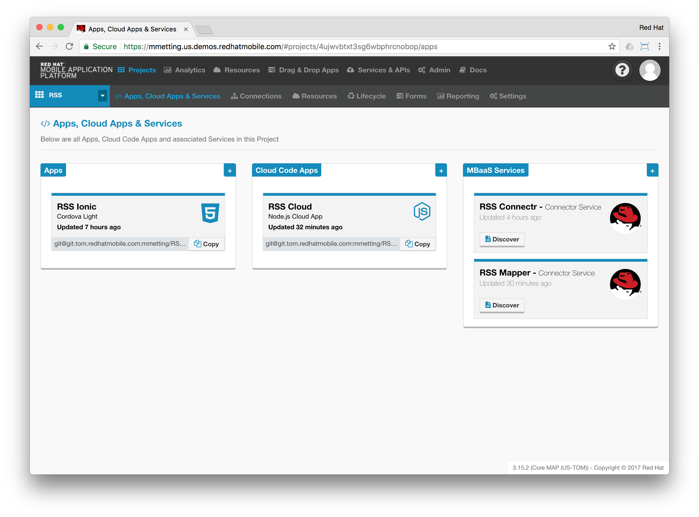
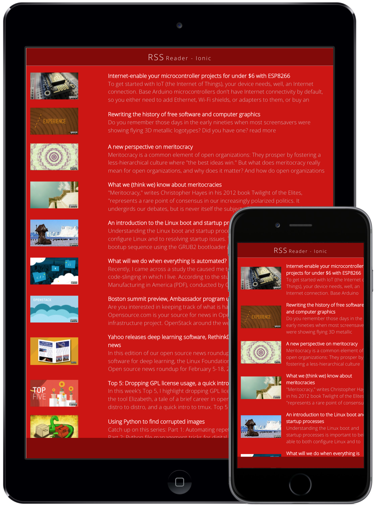

# RHMAP-RSS-Reader-Demo
This is a demo project utilising various capabilities of the Red Hat Mobile Application Platform. It consists of two client apps (iOS and Ionic) to show RSS feeds from the internet. The RSS feeds are offered by an API within a Cloud Application on Red Hat Mobile. Since feeds are usually exposed as XML-structured data, the feed is transformed and mobile-optimised by means within RHMAP: e.g. the usage of Node modules and the new API-Mapper capability.

## Client apps
- [Hybrid Ionic based app](https://github.com/mmetting/RSS-Reader-Demo-App-Ionic)
- Native iOS Swift based app (will be added later)

## Cloud Application
-  [Cloud App](https://github.com/mmetting/RHMAP-RSS-Reader-Demo-Cloud-App)

## MBaaS Services
- [Connector Service](https://github.com/mmetting/RSS-Reader-Demo-RSS-Connector)
- [Mapping Service](https://github.com/mmetting)

## Usage of the provided repos

> All instructions are provided in the linked repos

1. Start with importing the [Hybrid Ionic based app](https://github.com/mmetting/RSS-Reader-Demo-App-Ionic)
2. Continue with the [Cloud App](https://github.com/mmetting/RHMAP-RSS-Reader-Demo-Cloud-App)
3. Add the [Connector Service](https://github.com/mmetting/RSS-Reader-Demo-RSS-Connector)
4. Provision the [Mapping Service](https://github.com/mmetting)
5. Configure the usage of the deployed [Mapping Service](https://github.com/mmetting) within the [Cloud App](https://github.com/mmetting/RHMAP-RSS-Reader-Demo-Cloud-App)
6. Check out your imported [Client App:](https://github.com/mmetting/RSS-Reader-Demo-App-Ionic)

## TODO: The story behind this use case: aka Agile Development & DevOps

1. Create new project
2. Mock data from server side
3. Iteratively prototype and implement client (Ionic – Cordova app)
5. Create a connector to back-end system
6. Transform data from back-end system, make this a reusable service
7. Replace mock data with back-end data